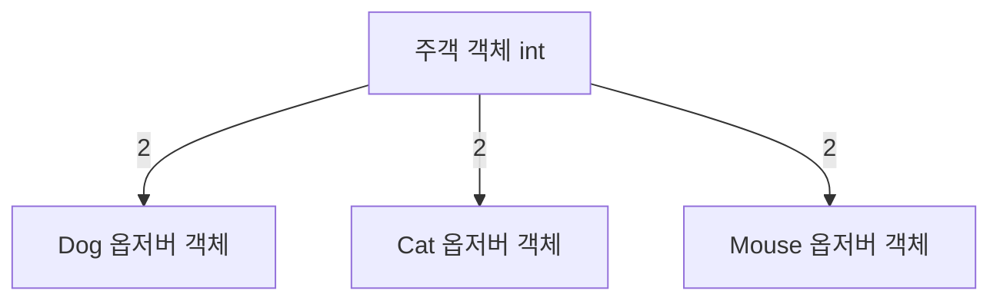

헤드퍼스트 디자인패턴 2장 옵저버패턴에 대해 요약정리한 내용입니다.

# 가상 모니터링 애플리케이션 알아보기
책에서 예제로 주어진 '가상 모니터링 애플리케이션'에 대한 설명.
- 기상 스테이션(실제 기상 정보를 수집하는 물리장비)
- WeatherData 객체 (기상 스테이션으로부터 오는 정보를 추적하는 객체)
- 디스플레이 장비

# WeatherData 클래스 살펴보기
클래스내부에 있는 메소드
- getTemperature()
- getHumidity()
- getPressure()
- measurementChanged() // 기상 관측값이 갱신될때마다 호출됨. (디스플레이 업데이트)

# 구현 목표
소프트웨어 개발에서 바뀌지 않는 단 하나는 뭐다? '변화'
이 시스템에서 변화할만한 건 무엇이 있을까.
- 디스플레이를 추가할 수 있을지도 모른다

이에 따라 확장성을 고려해보자.
사용자가 마음대로 디스플레이 요소를 더하거나 뺄 수 있게 해주는 것.
(지금은 온도 습도 기압이 모두 표기되지만, 하나만 표시되거나 다른 것이 추가되거나 할 수 있다)

# 유연하지 않은 코드의 예
만약 이렇게 추가한다면...?
```cs
public void measurementsChanged()
{
  float temp = getTemperature();
  float humidity = getHumidity();
  float pressure = getPressure();

  // 구체적인 구현에 맞춰서 코딩했으므로, 
  // 프로그램을 고치지 않고는 다른 디스플레이 항목을 추가하거나 제거할 수 없음
  // 바뀔 수 있는 부분이므로 캡슐화가 필요
  currentConditionsDisplay.update(temp, humidity, pressure);
  statisticsDisplay.update(temp, humidity, pressure);
  forecastDisplay.update(temp, humidity, pressure);
}
```

#  옵저버 패턴이란

- 주객 객체: 주제에서 중요한 데이터를 관리 (int)
- 주제 데이터가  바뀌면 옵저버에게 소식이 전해짐 (2 전달)
- 옵저버 객체들은  주제를 구독하고 있으며(주제객체에 등록되어있으며)
  주제 데이터가 바뀌면 갱신 내용을 전달받음



**옵저버 패턴**
: 한 객체의 상태가 바뀌면 그 객체에 의존하는 다른 객체에게 연락이 가고 자동으로 내용이 갱신되는  방식으로, 일대다(one-to-many) 의존성을 정의

**출판-구독 패턴(Public)**
: 관계가 있긴 하지만 같진 않다. 구독자가 서로 다른 유형의 메시지에 관심을 가질 수 있고, 출판사와 구독자를 더 세세하게 분리할 수 있는 복잡한 패턴. (미들웨어 시스템에서 종종 쓰인다)

# 옵저버 패턴의 구조

- Subject (interface): 주제를 나타내는 Subject 인터페이스
	- registerObserver()
	- removeObserver()
	- notifyObservers()
-  Observer(interface): 옵저버가 될 가능성이 있는 객체는 반드시 이 인터페이스를 구현 
	- update(): 주제의 상태가 바뀌었을 때 호출됨
- ConcreteSubject: Subject 인터페이스를 구현한 클래스.
	- registerObserver()
	- removeObserver()
	- notifyObservers()
	- getState()
	- setState()
- ConcreteObserver: Observer 인터페이스를 구현한 클래스.
	- update()

주제가 상태를 저장하고 제어, 따라서 상태가 들어있는 객체는 하나만 있다.
옵저버는 상태를 사용하지만 반드시 소유할 필요는 없다. 따라서 옵저버는 여러개 있을 수 있다.
주제에서 상태가 바뀌었다는 사실을 알려주기 때문에 주제에 의존적.

# 느슨한 결합
객체들이 상호작용할 수 있지만 서로 잘 모르는 관계.
옵저버 패턴이 이를 보여주는 훌륭한 예.

- 주제는 옵저버가 특정 인터페이스(Observer인터페이스)를 구현한다는 사실만 알고 있다
- 옵저버는 언제든지 새로 추가할 수 있다
- 새로운 형식의 옵저버를 추가할 때도 주제를 변경할 필요가 없다
- 주제와 옵저버는 서로 독립적으로 재사용이 가능하다
- 주제나 옵저버가 달라져도 서로에게 영향을 미치지 않는다

**디자인 원칙 중 네번째**
**'상호작용하는 객체 사이에는 가능하면 느슨한 결합을 사용해야한다.'**

# 옵저버패턴으로 구현한 기상시스템

- Subject (interface)
- Observer (interface): Subject를 본다
- DisplayElement (interface)
- WeatherData: Subject
// 이하의 Display는 모두 WeatherData를 본다
- CurrentConditionsDisplay: Observer, DisplayElement
- StatisticsDisplay: Observer, DisplayElement
- ForecastDisplay: Observer, DisplayElement
- ThirdPartyDisplay: Observer, DisplayElement

# Push를 Pull로 변경하기
현재 WeatherData는 주제가 옵저버로 데이터를 보내는 Push 방식으로 구현되어있다.
하지만 이를 옵저버가 주제에게 데이터를 당겨오는 Pull 방식으로 구현하면 유연성이 더욱 올라간다. 

Push 방식은 update() 메소드에 모든 데이터를 보내도록 설계되어있다.
하지만 Pull 방식은 필요한 데이터를 골라서 가져가기 때문에 확장성이 올라간다.

- 주제에서 알림 보내기
	- 옵저버의 update메소드를 인자 없이 호출하도록 수정
	- 옵저버 인터페이스에서도 update() 메소드에 매개변수가 없도록 수정
- 옵저버에서 알림 받기
	- 옵저버 update()에서 WeatherData의 게터 메소드를 바로 호출
	- `this.temperature = weatehrData.getTemperature();`


예시

```cs
public class ForecastDisplay: IObserver, IDisplayElement
{
  public float currentPressure = 29.92f;
  public float lastPressure;
  
  private WeatherData weatherData; 

  public ForecastDisplay(WeatherData weatherData)
  {
    this.weatherData = weatherData;
    weatherData.registerobserver(this);
  }

  public void display()
  {
    // display...
  }

  public void update()
  {
    lastPressure = currentPressure;
    currentPressure = weatherData.getPressure();
    this.display();
  }
}

```


# 마무리
- 객체지향 원칙  (update!)
	- 바뀌는 부분은 캡슐화한다
	- 상속보다는 구성을 활용한다
	- 구현보다는 인터페이스에 맞춰서 프로그래밍한다
	- 상호작용하는 객체 사이에서는 가능하면 느슨한 결합을 사용해야한다 (new!)
- 옵저버 패턴
	- 한 객체의 상태가 바뀌면 그 객체에 의존하는 다른 객체에게 연락이 가고 자동으로 내용이 갱신되는 방식으로 일대다(one-to-many) 의존성을 정의합니다


