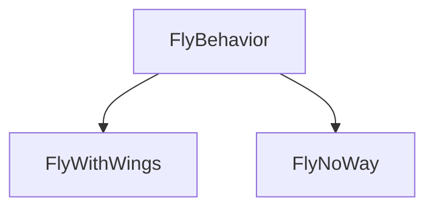

헤드퍼스트 디자인패턴 1장 전략패턴에 대해 요약정리한 내용입니다.

# 클래스 상속의 문제점
오리를 만든다고 쳐보자. 처음에는 슈퍼코드에 다음과 같은 기능만 존재했다.
```
quack(), swim(), display()
```
그런데 여기에 하늘을 나는 오리를 추가하고 싶어서 `fly()` 를 추가했더니 고무오리도 날게되었다.
그래서 고무오리는 `fly()`를 `override`하여 아무것도 하지 않도록 했다.

여기서 문제는
- 서브 클래스에서 코드가 중복된다
- 실행 시에 특징을 바꾸기 힘들다
- 모든 오리의 행동을 알기 힘들다
- 코드를 변경했을 때 다른 오리들에게 원치 않은 영향을 끼칠 수 있다

# 그렇다면 인터페이스는?
앞으로도 규격이 계속 바뀐다면 모든 Duck들의 서브클래스 fly와 quack 메소드를 일일히 살펴보고 상황에 따라 오버라이드 해야한다는 문제가 생긴다.
따라서 이렇게 해결한다면 어떨까
- `fly()`와 `quack()`을 슈퍼클래스에서 빼고, `Flyable`과 `Quackable` 인터페이스를 만든다.
이렇게 하면  날 수 있고 꽥꽥거리는 오리에게만 인터페이스를 상속시키면 된다?

-> 바보같은 아이디어.
코드 중복이 너무 많이 일어난다!

# 그럼 어떻게 해야할까
소프트웨어 개발 불변의 진리를 논하기 전에, 왜 소프트웨어에 변화가 일어나는지 살펴보자
- 고객이나 사용자가  다른 것을  요구하거나 새로운 기능을 원할 때
- 회사에서 데이터베이스 종류를 바꾸고 데이터도 전과 다른 데서 구입하기로 했는데, 그게 지금 사용하는 데이터 포맷과 완전히 다른 경우
- 기술이 발전하면서 어떤 규약을 사용하려고 코드를 갱신했을 때
- 시스템을 만드는 과정에서 이것저것 배우고 나니 다시  앞부분으로 돌아가서 더 좋게 고치고 싶었을 때

등등...

**디자인 원칙 중 가장 첫번째**
**'애플리케이션에서 달라지는 부분을 찾아내고, 달라지지 않는 부분과 분리한다'**
= 달라지는 부분을  찾아서 나머지 코드에 영향을 주지 않도록 '캡슐화'한다

이것이 다른 모든 디자인 패턴의 기반을 이루는 원칙
# 바뀌는 부분과 그렇지 않은 부분 분리하기
바뀌는 부분의 클래스 집합(set)을 만들고, 행동을 구현한 것을 전부 집어넣는다 
예를들면)
- 꽥꽥거리는 것과 관련된 부분
	- 꽥꽥거리는 행동 구현 클래스
	- 삑삑거리는 행동 구현 클래스
	- 아무소리도 내지 않는 행동 구현 클래스

# 오리의 행동 디자인하고 구현하기
각 행동은 인터페이스(예: `FlyBehaviour`, `QuackBehavior`)로 표현
인터페이스를 사용해서 행동을 구현

**디자인 원칙 중 두번째**
**'구현보다는 인터페이스에 맞춰서 프로그래밍 한다'**

다음과 같은 모양이 된다
FlyBehavior는 반드시 구현해야하는 fly() 메소드를 가졌다.

이제부터 Duck의 행동은 특정 행동 인터페이스를 구현한 별도의 클래스 안에 들어있다.
그러면 Duck 클래스에서는 그 행동을 구체적으로 구현할 필요가 없어진다.

여기서 인터페이스란 자바나 C#의 `interface`를 이용하란 것이 아니라 더 넓은 의미의 개념을 말함.
실제 실행 시에 쓰이는 객체가 코드에 고정되지 않도록 상위 형식에 맞춰서 프로그래밍 하라는 뜻.

- 변수를 선언할 떄 보통 추상 클래스나 인터페이스 같은 상위 형식으로 선언해야한다
- 객체를 변수에 대입할 때 상위 형식을 구체적으로 구현한 형식이라면 어떤 객체든 넣을 수 있기 때문이다
- 그러면 변수를 선언하는 클래스에서 실제 객체의 형식을 몰라도 된다

예를들면
```cs
Dog d = new Dog();
d.bark();
```
가 아니라
```cs
Animal animal = new Dog();
animal.makeSound();
```
가 좋고, 여기서 더 바람직한 방법은
```cs
a = getAnimal();
a.makeSound();
```
처럼 하위 형식들 중 어떤 형식인지는 모르지만 makeSound()에 올바른 반응만 할 수 있으면 되는 구체적으로 구현된 객체를 실행시에 대입시키는 것이다.

이러면 다른 형식의 객체에서도 행동을 재사용하기가 쉬워진다. 각 행동들이 더이상 하위 객체에 숨겨져 있지 않기 때문에. 새로운 행동도 추가하기 쉬워진다.

# 예제
- 만약 로켓의 추진력으로 날아가는 행동을 추가해야 한다면?
	- `flyBehavior`를 상속받은 `FlyWithRocket` 클래스를 만들고 구현
- 오리 클래스가 아닌 다른 클래스에서 Quack을 활용할 방법이 있다면?
	- 오리 소리 흉내를 내는 기기 구현

# 행동 통합하기
- `Duck` 클래스 안에 `flyBehavior`와 `quackBehavior` 라는 인터페이스 형식의 인스턴스 변수 추가
- 각 오리 객체에서 실행 시 이 변수에 특정 행동 형식(`FlyWithWings`,`Squeak` 등)의 레퍼런스를 다형적으로 설정
- `Duck` 클래스 안에 `fly()`나 `quack()` 대신 `performFly()`와 `performQuack` 메소드 추가
- `performQuak` 구현
  ```cs
	  public abstract class Duck
	  {
	    // 모든 Duck에는 QuackBehavior 인터페이스를  구현하는 것의 레퍼런스가 존재
	    QuackBehavior quackBehavior;
	    public void performQuack()
	    {
	      // 꽥꽥거리는 행동을 직접 처리하는 대신, 행동을 위임
	      quackBehavior.quack();
	    }
	  }
	```
- `flyBehavior`와 `quackBehavior` 인스턴스 변수 설정 방법
  ```cs
      public class MallardDuck : Duck
      {
          public MallardDuck()
          {
            quackBehavior = new Quack();
            flyBehavior = new FlyWithWings();
          }
          public void display()
          {
            print("저는 물오리입니다.");
          }
      }
    ```

# 동적으로 행동 지정하기
오리의 행동 형식을 생성자에서 인스턴스로 만드는 방법이 아니라,
Duck의 서브클래스에서 Setter method를 호출하는 방법으로 설정하면 동적으로 행동을 지정할 수 있다.

Duck 클래스에 `setFlyBehavior`와 `setQuackBehavior`를 추가한다.
```cs
public void setFlyBehavior(FlyBehavior fb)
{
  flyBehavior = fb;
}

public void setQuackBehavior(QuackBehavior qb)
{
  quackBehavior = qb;
}
```

Duck의 서브클래스를 새로 만든다
```cs
// 모형오리: 소리만 나고 날 순 없다
public class ModelDuck : Duck
{
  public ModelDuck()
  {
    flyBehavior = new FlyNoWay();
    quackBehavior = new Quack();
  }
}
```

여기서 ModelDuck의 나는 기능을 동적으로 수정하고 싶다면,
다른 시뮬레이터  클래스에서 다음과 같이 로켓 추진 기능을 부여할 수 있습니다.
```cs
public class MiniDuckSimulator
{
  public static void main(string[] args)
  {
    Duck model = new ModelDuck();
    model.performFly(); // 못난다
    model.setFlyBehavior(new FlyRocketPowered());
    model.performFly(); // 로켓으로 난다
  }
}
```

# 캡슐화된 행동 살펴보기
오리의 행동들을 일련의 행동으로 생각하는 대신, 알고리즘군(family of  algorithms)로 생각해보자.
클래스를 구현할 때 'A는 B이다'관계인지, 'A에는 B가 있다' 관계인지, 'A가 B를 구현하는' 관계인지 직접 연필로 써보자.

# 두 클래스를 합치는 방법
'A는 B이다'보다 'A에는 B가 있다'가 나을 수 있다.
각 오리에는 FlyBehavior와 QuackBehavior가 있으며, 각각 나는 행동과 꽥꽥거리는 행동을 위임받는다.
이런 식으로 두 클래스를 합치는 것을 '구성(composition)을 이용한다'라고 부른다.
오리 클래스에서 행동을 상속받는 대신, 행동 객체로 구성되어 행동을 부여받는 것.

**디자인 원칙 중 세번째**
**'상속보다는 구성을 활용한다'**

이 경우 다음과 같은 장점이 있다.
-  유연성을 크게 향상 시킬 수 있음
- 알고리즘군을 별도의 클래스 집합으로 캡슐화 할 수 있음
- 실행 시에 행동을 동적으로 바꿀 수 있음

= 상속 말고도 재사용할 수 있는 방법에 대해 깊이 생각해보아야 한다.

# 전략패턴
지금까지 배운 것이 전략 패턴이다
'알고리즘군을 정의하고 캡슐화하여 각각의 알고리즘군을 수정해서 쓸 수 있게 해준다'

# 마무리: 지금까지 알게 된 것
- 객체지향의 기초
	- 추상화
	- 캡슐화
	- 다형성
	- 상속
- 객체지향의 원칙
	- 바뀌는 부분은 캡슐화 한다
	- 상속보다는 구성을 활용한다
	- 구현보다는 인터페이스에 맞춰서 프로그래밍한다
- 객체지향의 패턴
	- 전략패턴

